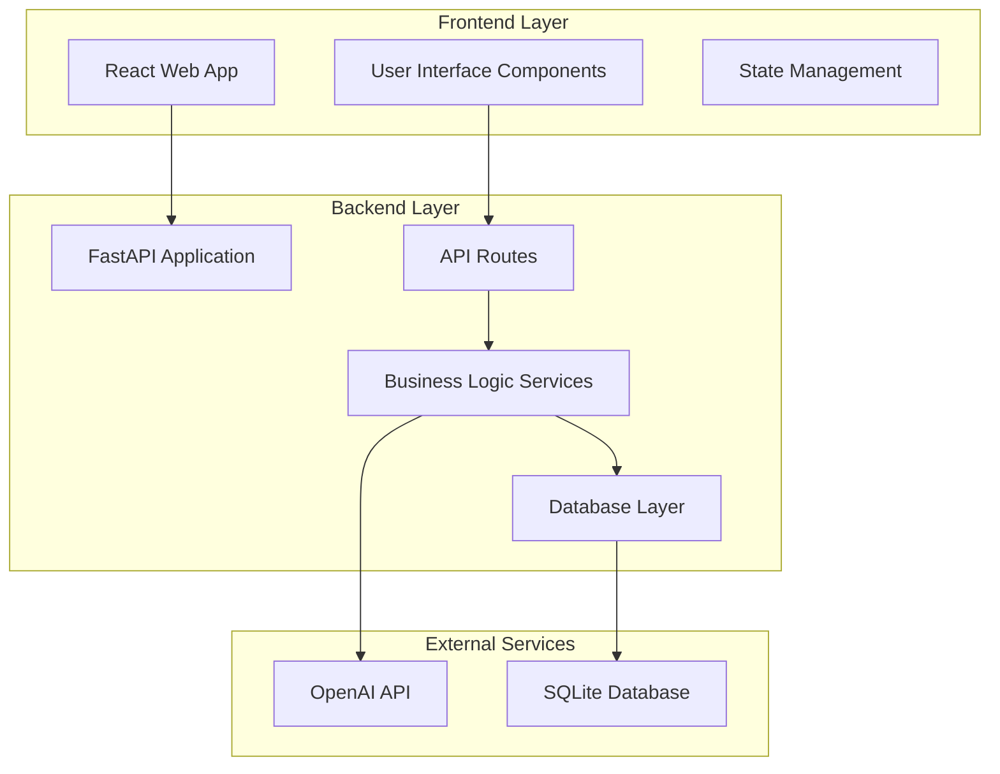

# Design Document

## Overview

The Student Learning Buddy is built as a modern web application with a FastAPI backend serving a React frontend. The system integrates with OpenAI's GPT models to provide intelligent tutoring capabilities including question answering, quiz generation, and content summarization. The architecture follows a clean separation of concerns with distinct layers for API routing, business logic, data access, and external service integration.

## Architecture

### System Architecture



### Technology Stack

**Backend:**
- FastAPI: Modern, fast web framework with automatic API documentation
- Python 3.9+: Core programming language
- SQLAlchemy: ORM for database operations
- Pydantic: Data validation and serialization
- OpenAI Python SDK: AI model integration
- Uvicorn: ASGI server for production deployment

**Frontend:**
- React 18: Component-based UI framework
- TypeScript: Type-safe JavaScript development
- Axios: HTTP client for API communication
- React Router: Client-side routing
- Tailwind CSS: Utility-first CSS framework
- React Query: Server state management

**Database:**
- SQLite: Lightweight, file-based database for MVP
- Alembic: Database migration management

## Components and Interfaces

### Backend Components

#### 1. API Layer (`/app/api/`)

**Routes:**
- `/api/ask` - Question answering endpoint
- `/api/quiz` - Quiz generation endpoint  
- `/api/notes` - Text summarization endpoint
- `/api/profile` - Student profile management
- `/api/health` - System health check

**Request/Response Models:**
```python
# Question Request
class QuestionRequest(BaseModel):
    question: str
    explanation_style: str = "simple"  # simple, exam-style, real-world
    student_id: Optional[int] = None

# Question Response
class QuestionResponse(BaseModel):
    answer: str
    explanation_steps: List[str]
    related_topics: List[str]
    confidence_score: float

# Quiz Request
class QuizRequest(BaseModel):
    topic: str
    question_count: int = 5
    difficulty: str = "medium"
    question_types: List[str] = ["multiple_choice", "true_false"]

# Quiz Response
class QuizResponse(BaseModel):
    questions: List[QuizQuestion]
    topic: str
    estimated_time: int

class QuizQuestion(BaseModel):
    id: str
    question: str
    type: str
    options: Optional[List[str]]
    correct_answer: str
    explanation: str
```

#### 2. Service Layer (`/app/services/`)

**AIService:**
- Handles OpenAI API integration
- Manages prompt engineering for different explanation styles
- Implements retry logic and error handling
- Caches frequent responses to reduce API costs

**QuizService:**
- Generates diverse question types
- Validates question quality and difficulty
- Manages quiz scoring and feedback

**NotesService:**
- Processes text summarization requests
- Handles content chunking for large texts
- Formats output with proper structure

**ProfileService:**
- Manages student profile operations
- Tracks learning progress and preferences
- Provides personalization recommendations

#### 3. Data Layer (`/app/models/`)

**Database Models:**
```python
class Student(Base):
    id: int
    name: str
    email: Optional[str]
    preferred_subjects: List[str]
    last_studied_topic: Optional[str]
    created_at: datetime
    updated_at: datetime

class StudySession(Base):
    id: int
    student_id: int
    session_type: str  # question, quiz, notes
    topic: str
    content: str
    ai_response: str
    created_at: datetime

class QuizAttempt(Base):
    id: int
    student_id: int
    quiz_data: dict
    answers: dict
    score: float
    completed_at: datetime
```

### Frontend Components

#### 1. Core Components (`/src/components/`)

**Layout Components:**
- `Header`: Navigation and user profile access
- `Sidebar`: Quick access to different features
- `MainContent`: Primary content area

**Feature Components:**
- `QuestionForm`: Input form for asking questions
- `AnswerDisplay`: Formatted display of AI responses
- `QuizInterface`: Interactive quiz taking experience
- `NotesGenerator`: Text input and summary output
- `ProfileManager`: Student profile editing

**Shared Components:**
- `LoadingSpinner`: Loading state indicator
- `ErrorBoundary`: Error handling wrapper
- `Button`, `Input`, `Card`: Reusable UI elements

#### 2. State Management (`/src/store/`)

**React Query Integration:**
- API call caching and synchronization
- Optimistic updates for better UX
- Background refetching for fresh data

**Local State:**
- User session management
- Form state handling
- UI state (modals, notifications)

## Data Models

### Student Profile Schema
```sql
CREATE TABLE students (
    id INTEGER PRIMARY KEY AUTOINCREMENT,
    name VARCHAR(100) NOT NULL,
    email VARCHAR(255) UNIQUE,
    preferred_subjects TEXT, -- JSON array
    last_studied_topic VARCHAR(255),
    learning_style VARCHAR(50),
    created_at TIMESTAMP DEFAULT CURRENT_TIMESTAMP,
    updated_at TIMESTAMP DEFAULT CURRENT_TIMESTAMP
);
```

### Study Session Schema
```sql
CREATE TABLE study_sessions (
    id INTEGER PRIMARY KEY AUTOINCREMENT,
    student_id INTEGER REFERENCES students(id),
    session_type VARCHAR(20) NOT NULL,
    topic VARCHAR(255),
    content TEXT,
    ai_response TEXT,
    metadata TEXT, -- JSON for additional data
    created_at TIMESTAMP DEFAULT CURRENT_TIMESTAMP
);
```

### Quiz Attempt Schema
```sql
CREATE TABLE quiz_attempts (
    id INTEGER PRIMARY KEY AUTOINCREMENT,
    student_id INTEGER REFERENCES students(id),
    quiz_data TEXT, -- JSON quiz questions
    student_answers TEXT, -- JSON student responses
    score DECIMAL(5,2),
    time_taken INTEGER, -- seconds
    completed_at TIMESTAMP DEFAULT CURRENT_TIMESTAMP
);
```

## Error Handling

### Backend Error Handling

**API Level:**
- Custom exception classes for different error types
- Global exception handler for consistent error responses
- Request validation with detailed error messages
- Rate limiting to prevent abuse

**Service Level:**
- OpenAI API error handling with exponential backoff
- Database connection error recovery
- Input sanitization and validation
- Logging for debugging and monitoring

**Error Response Format:**
```python
class ErrorResponse(BaseModel):
    error: str
    message: str
    details: Optional[dict] = None
    timestamp: datetime
```

### Frontend Error Handling

**Network Errors:**
- Retry mechanism for failed requests
- Offline detection and user notification
- Graceful degradation when services unavailable

**User Input Errors:**
- Real-time form validation
- Clear error messages with suggestions
- Prevention of invalid submissions

**Application Errors:**
- Error boundaries to catch React errors
- Fallback UI components
- Error reporting to help with debugging

## Testing Strategy

### Backend Testing

**Unit Tests:**
- Service layer business logic testing
- Database model validation
- API endpoint response validation
- Mock OpenAI API responses for consistent testing

**Integration Tests:**
- End-to-end API workflow testing
- Database integration testing
- External service integration testing

**Test Tools:**
- pytest: Primary testing framework
- pytest-asyncio: Async test support
- httpx: HTTP client for API testing
- SQLAlchemy test utilities: Database testing

### Frontend Testing

**Component Tests:**
- React component rendering and behavior
- User interaction simulation
- Props and state management testing

**Integration Tests:**
- API integration testing
- User workflow testing
- Cross-browser compatibility

**Test Tools:**
- Jest: JavaScript testing framework
- React Testing Library: Component testing utilities
- MSW (Mock Service Worker): API mocking
- Cypress: End-to-end testing

### Performance Testing

**Load Testing:**
- Concurrent user simulation
- API response time measurement
- Database query performance
- OpenAI API rate limit handling

**Monitoring:**
- Application performance metrics
- Error rate tracking
- User experience monitoring
- Resource usage optimization

## Security Considerations

**API Security:**
- CORS configuration for frontend access
- Rate limiting to prevent abuse
- Input validation and sanitization
- Secure handling of OpenAI API keys

**Data Protection:**
- Student data privacy compliance
- Secure session management
- Database access controls
- Audit logging for sensitive operations

**Frontend Security:**
- XSS prevention through proper escaping
- Secure API communication over HTTPS
- Client-side input validation
- Secure storage of user preferences